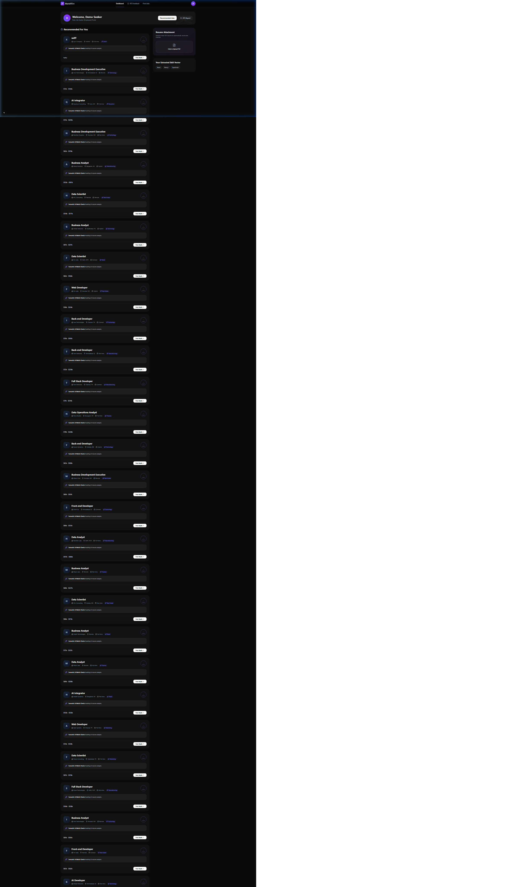

<div align="center">

# ✨ AuraHire — AI-Powered Hiring Marketplace

**The smartest way to connect talent with opportunity.**  
A full-stack Next.js hiring platform with AI-driven resume analysis, semantic job matching, ATS scoring, and a powerful recruiter dashboard — all in a sleek, dark-mode UI.

[](https://nextjs.org/)
[](https://www.typescriptlang.org/)
[](https://www.prisma.io/)
[](https://tailwindcss.com/)
[](https://openrouter.ai/)

</div>

---

## 📸 Screenshots

| Landing Page | Login / Sign Up |
|:---:|:---:|
|  |  |

| Job Seeker Dashboard | Recruiter ATS Dashboard |
|:---:|:---:|
|  |  |

---

## 🚀 Features

### 🎯 For Job Seekers
- **AI Resume Analysis** — Upload a PDF resume and get instant skill extraction, ATS scoring, and semantic job matching powered by LLM.
- **Semantic Job Matching** — Each job listing is scored 0–100 based on how well your resume semantically matches the job requirements.
- **ATS Optimization Report** — Get a detailed report showing formatting errors, improvement suggestions, and an overall ATS readiness score.
- **Structured Resume Viewer** — Your uploaded resume is parsed and displayed in a clean, structured format.
- **Easy Apply** — One-click job applications with automatic resume submission.
- **Re-Apply** — Re-submit your latest resume to any previously applied job.
- **Role Switching** — Instantly switch between Seeker and Recruiter mode.

### 🏢 For Recruiters
- **ATS Candidate Dashboard** — View all applicants ranked by AI match score for your posted jobs.
- **Post Jobs** — Create detailed job postings with title, description, salary range, location, employment type, and domain tags.
- **Candidate Search & Filter** — Search candidates by name/email, filter by posted role, and sort by AI match score or date applied.
- **Resume Viewer Modal** — View a candidate's parsed and structured resume in a beautiful fullscreen modal.
- **Resume Download** — Download any candidate's parsed resume as a text file with one click.
- **Shortlisting** — Candidates with an AI score ≥ 65 are automatically highlighted as "Shortlisted".
- **Posted Jobs Management** — View all your active job listings with applicant counts.

### 🔐 Admin Panel
- **Secure Admin Login** — Protected via secret key (no email/password — zero database exposure).
- **User Directory** — View and manage all registered job seekers and recruiters.
- **Search & Filter** — Search users by name/email, filter by role (seeker/recruiter), and sort by name, role, or join date.
- **User Stats** — See per-user stats: number of applications (seekers) or number of companies (recruiters).
- **Drill Down** — Navigate to detailed seeker or recruiter profile pages.

### 🌐 Platform-wide
- **Authentication** — Cookie-based session management (no passwords) with 1-week expiry.
- **Role-Based Access Control** — Middleware enforces route protection for seeker, recruiter, and admin portals.
- **Auto Redirect** — Logged-in users are automatically redirected to their correct portal.
- **Account Deletion** — Users can delete their account from the profile dropdown.
- **Responsive Design** — Mobile-first layout that adapts to all screen sizes.

---

## 🏗️ Tech Stack

| Layer | Technology |
|---|---|
| **Framework** | Next.js 16 (App Router) |
| **Language** | TypeScript 5 |
| **Styling** | Tailwind CSS 4 |
| **ORM** | Prisma 5 (SQLite for dev, PostgreSQL for prod) |
| **AI / LLM** | OpenRouter API (configurable model) |
| **PDF Parsing** | pdf2json |
| **Icons** | Lucide React |

---

## 📁 Project Structure

```
ai-hiring-platform/
├── prisma/
│   ├── schema.prisma        # Database schema (User, Job, Application, etc.)
│   └── seed.ts              # Seed script with realistic fake data
│
├── public/
│   └── screenshots/         # App screenshots for README
│
├── src/
│   ├── app/
│   │   ├── page.tsx         # Landing page (/)
│   │   ├── layout.tsx       # Root layout
│   │   │
│   │   ├── login/           # Login & Sign Up page (/login)
│   │   ├── seeker/          # Job Seeker Dashboard (/seeker)
│   │   │   └── jobs/        # Browse all jobs (/seeker/jobs)
│   │   ├── recruiter/       # Recruiter ATS Dashboard (/recruiter)
│   │   │   └── post-job/    # Post a new job (/recruiter/post-job)
│   │   ├── admin/           # Admin User Directory (/admin)
│   │   │   ├── login/       # Admin login (/admin/login)
│   │   │   ├── seekers/     # Seeker profile detail (/admin/seekers/[id])
│   │   │   └── recruiters/  # Recruiter profile detail (/admin/recruiters/[id])
│   │   │
│   │   └── api/
│   │       ├── analyze/     # POST /api/analyze — AI resume analysis
│   │       ├── apply/       # POST /api/apply — Job application submission
│   │       ├── jobs/        # GET /api/jobs — List all jobs
│   │       └── auth/
│   │           ├── login/       # POST /api/auth/login
│   │           ├── logout/      # POST /api/auth/logout
│   │           ├── me/          # GET /api/auth/me | DELETE
│   │           ├── role/        # GET /api/auth/role
│   │           └── switch-role/ # POST /api/auth/switch-role
│   │
│   ├── components/
│   │   └── ResumeRenderer.tsx  # Shared resume display component
│   │
│   ├── lib/
│   │   └── prisma.ts           # Prisma client singleton
│   │
│   └── middleware.ts           # Route protection & RBAC middleware
│
├── .env.local                  # Environment variables (not committed)
├── package.json
└── next.config.ts
```

---

## ⚙️ API Reference

### Auth Endpoints

#### `POST /api/auth/login`
Creates a new session (sign up or sign in).

**Request Body:**
```json
{
  "email": "user@example.com",
  "name": "John Doe",           // required for sign up
  "phone": "1234567890",        // required for sign up
  "role": "seeker" | "recruiter" | "admin",
  "isSignUp": true,             // true = register, false = login
  "adminSecret": "secret_key"   // required only for admin role
}
```

**Response:**
```json
{
  "success": true,
  "user": { "id": "...", "name": "...", "email": "...", "role": "seeker" }
}
```
Also sets HTTP-only cookies: `userId`, `userRole`, `userName`, `userEmail`.

---

#### `POST /api/auth/logout`
Clears all session cookies and ends the session.

**Response:** `200 OK`

---

#### `GET /api/auth/me`
Returns the currently authenticated user's profile, including resume data, skills, ATS feedback, and applications.

**Response:**
```json
{
  "success": true,
  "user": {
    "id": "...",
    "name": "...",
    "email": "...",
    "role": "seeker",
    "resumeText": "...",
    "resumeName": "resume.pdf",
    "structuredResume": "...",
    "skills": "React, TypeScript, Node.js",
    "atsFeedback": "{ \"score\": 82, ... }",
    "applications": [...]
  }
}
```

---

#### `DELETE /api/auth/me`
Permanently deletes the current user's account and all associated data.

**Response:** `200 OK`

---

#### `GET /api/auth/role`
Returns the current user's role from cookies (fast, no DB call).

**Response:**
```json
{ "role": "seeker" }
```

---

#### `POST /api/auth/switch-role`
Toggles the user's role between `seeker` and `recruiter` and updates the session cookie.

**Response:** `200 OK` with updated `userRole` cookie.

---

### Jobs Endpoints

#### `GET /api/jobs`
Returns all jobs with their associated company information.

**Response:**
```json
{
  "success": true,
  "jobs": [
    {
      "id": "...",
      "title": "Senior React Developer",
      "location": "Remote",
      "employmentType": "Full-time",
      "salaryRange": "$90k - $120k",
      "domain": "Engineering",
      "description": "...",
      "company": { "id": "...", "name": "Acme Corp", "logoUrl": null }
    }
  ]
}
```

---

### AI Analysis Endpoint

#### `POST /api/analyze`
Analyzes a resume using AI. Accepts either a PDF file upload or raw resume text.

**Request (multipart/form-data — file upload):**
```
resume: File (PDF)
jobs: JSON string of [{ id, title, description }]
```

**Request (application/json — text input):**
```json
{
  "resumeText": "Raw resume text...",
  "resumeName": "resume.pdf",
  "jobs": [{ "id": "...", "title": "...", "description": "..." }]
}
```

**Response:**
```json
{
  "success": true,
  "resumeText": "Full raw extracted text...",
  "resumeName": "resume.pdf",
  "analysis": {
    "skills": ["React", "TypeScript", "Node.js"],
    "atsFeedback": {
      "score": 78,
      "formattingErrors": ["Missing LinkedIn URL"],
      "suggestions": ["Add quantified achievements to work experience"]
    },
    "structuredResume": {
      "basics": { "name": "Jane Doe", "email": "jane@example.com", "phone": "...", "location": "NYC", "headline": "Full Stack Engineer" },
      "education": [{ "institution": "MIT", "degree": "B.S. Computer Science", "endDate": "2022" }],
      "workExperience": [{ "company": "Acme", "position": "Engineer", "duration": "2022-Present", "highlights": ["Built X", "Improved Y by 30%"] }],
      "projects": [{ "name": "Project A", "description": "...", "technologies": ["React"] }]
    },
    "scores": [
      { "jobId": "cjxyz123", "matchScore": 87, "matchReason": "Strong React and TypeScript background aligns well." }
    ]
  }
}
```

---

### Application Endpoint

#### `POST /api/apply`
Submits or updates a job application for the currently authenticated seeker.

**Request Body:**
```json
{
  "jobId": "cjxyz123",
  "resumeText": "Full resume text...",
  "resumeName": "my_resume.pdf",
  "aiMatchScore": 87,
  "aiMatchReason": "Strong match due to React expertise."
}
```

**Response:**
```json
{
  "success": true,
  "updatedExisting": false,
  "application": { "id": "...", "jobId": "...", "seekerId": "..." }
}
```

---

### Admin Endpoints

#### `GET /api/admin/users`
Returns a filtered, sorted, paginated list of all users. Requires admin session.

**Query Parameters:**
| Param | Type | Default | Description |
|---|---|---|---|
| `search` | string | `""` | Filter by name or email |
| `role` | string | `"all"` | Filter by role: `seeker`, `recruiter`, or `all` |
| `sortBy` | string | `"createdAt"` | Sort field: `name`, `role`, `createdAt` |
| `order` | string | `"desc"` | Sort direction: `asc` or `desc` |

**Response:**
```json
{
  "success": true,
  "users": [
    {
      "id": "...",
      "name": "Jane Doe",
      "email": "jane@example.com",
      "role": "seeker",
      "createdAt": "2026-01-15T10:00:00Z",
      "_count": { "posts": 3, "companies": 0, "applications": 7 }
    }
  ]
}
```

---

## 🗄️ Database Schema

The app uses **Prisma ORM** with **SQLite** (development) or **PostgreSQL** (production).

```
User
├── id, email, name, phone, headline, avatarUrl
├── role (seeker | recruiter | admin)
├── resumeText, resumeName, structuredResume
├── skills (comma-separated)
├── atsFeedback (JSON string)
└── Relations: posts, comments, likes, companies, applications, connections

Post
├── id, content, imageUrl, authorId, createdAt
└── Relations: comments, likes

Job
├── id, title, location, employmentType, salaryRange, domain
├── description, companyId, createdAt
└── Relations: company, applications

Company
├── id, name, logoUrl, description, industry, ownerId
└── Relations: owner, jobs

Application
├── id, jobId, seekerId
├── resumeText, resumeName, structuredResume
├── aiMatchScore, aiMatchReason
└── Unique: [jobId, seekerId]

Connection
├── id, requesterId, recipientId
├── status (pending | accepted | rejected)
└── Unique: [requesterId, recipientId]
```

---

## 🔧 Function Reference

### Frontend Functions

#### Seeker Dashboard (`/src/app/seeker/page.tsx`)

| Function | Description |
|---|---|
| `loadData()` | Fetches all jobs and user profile on mount. Auto-runs AI matching if user has a saved resume. |
| `handleFileUpload(e)` | Handles PDF resume upload via `FormData`. Sends to `/api/analyze`, updates job scores, ATS feedback, and structured resume state. |
| `handleApply(jobId, matchScore, matchReason)` | Submits a job application to `/api/apply`. Prevents double-click via `submittingJobs` state. |
| `handleLogout()` | POSTs to `/api/auth/logout` and redirects to `/login`. |
| `handleSwitchRole()` | POSTs to `/api/auth/switch-role` and redirects to `/recruiter`. |
| `handleDeleteAccount()` | DELETEs via `/api/auth/me` after user confirmation. |

#### Recruiter Dashboard (`/src/app/recruiter/RecruiterDashboardClient.tsx`)

| Function | Description |
|---|---|
| `filteredApplications` | Computed list: filters by search query + selected job title, sorted by date or AI score. |
| `handleDownloadResume(app)` | Creates a Blob from resume text and triggers download as `.txt` file. |
| `getFormattedResume(text, structured)` | Returns structured resume JSON (pretty-printed) if available, else raw text. |
| `handleLogout()` | Logs out and redirects to `/login`. |
| `handleSwitchRole()` | Switches to seeker mode and redirects to `/seeker`. |
| `handleDeleteAccount()` | Confirms then deletes the recruiter account. |

#### Admin Dashboard (`/src/app/admin/page.tsx`)

| Function | Description |
|---|---|
| `fetchUsers()` | GETs `/api/admin/users` with current search, role filter, sort, and order params. Redirects to admin login on 401/403. |
| `handleSort(field)` | Toggles sort direction if same field, else sets new sort field with `desc` default. |

### Backend Functions

#### AI Analysis (`/src/app/api/analyze/route.ts`)

| Step | Description |
|---|---|
| PDF Parsing | Uses `pdf2json` to extract raw text from the uploaded PDF buffer. |
| AI Prompt | Sends resume text + job list to OpenRouter API with a structured prompt requesting skills, ATS feedback, structured resume, and per-job match scores. |
| JSON Parsing | Strips LLM markdown artifacts and extracts clean JSON from the response. |
| DB Persistence | Updates the `User` record with extracted skills, resume text, structured resume, and ATS feedback if a `userId` cookie is present. |

#### Middleware (`/src/middleware.ts`)

| Rule | Behavior |
|---|---|
| No cookies on protected route | Redirects to `/login` (or `/admin/login` for admin routes) |
| Non-admin accessing `/admin/*` | Redirects to `/admin/login` |
| Seeker accessing `/recruiter/*` | Redirects to `/seeker` |
| Recruiter accessing `/seeker/*` | Redirects to `/recruiter` |
| Authenticated user at `/login` | Redirects to their respective portal |

---

## 🛠️ Local Development Setup

### Prerequisites
- Node.js 18+
- npm or yarn
- An [OpenRouter API Key](https://openrouter.ai/)

### 1. Clone the repository
```bash
git clone https://github.com/YOUR_USERNAME/ai-hiring-platform.git
cd ai-hiring-platform
```

### 2. Install dependencies
```bash
npm install
```

### 3. Configure environment variables
Create a `.env.local` file in the project root:
```env
# AI Provider (OpenRouter)
OPENROUTER_API_KEY=your_openrouter_api_key_here

# Optional: Override the AI model (defaults to google/gemma-4-31b-it:free)
AI_MODEL=google/gemma-4-31b-it:free

# Admin panel access secret
ADMIN_SECRET=AuraAdmin2026!
```

### 4. Set up the database
```bash
# Run Prisma migrations to create the SQLite database
npx prisma db push

# (Optional) Seed with realistic fake data
npx prisma db seed
```

### 5. Start the development server
```bash
npm run dev
```

Open [http://localhost:3000](http://localhost:3000) to see the app.

---

## 🌐 Deployment Guide

### Option A: GitHub

#### Step 1: Initialize Git (if not already done)
```bash
git init
git add .
git commit -m "Initial commit: AuraHire AI Hiring Platform"
```

#### Step 2: Create a GitHub repository
1. Go to [github.com/new](https://github.com/new)
2. Name it `ai-hiring-platform`
3. Set it to **Public** or **Private**
4. Do **NOT** initialize with README (you already have one)
5. Click **Create repository**

#### Step 3: Push your code
```bash
git remote add origin https://github.com/YOUR_USERNAME/ai-hiring-platform.git
git branch -M main
git push -u origin main
```

> ⚠️ **Important:** Make sure `.env.local` is in your `.gitignore` to keep your API keys secret.

---

### Option B: Deploy to Vercel (Recommended)

Vercel is the easiest platform for Next.js apps and supports SQLite-based apps for prototyping.

#### Step 1: Push to GitHub (see above)

#### Step 2: Connect to Vercel
1. Go to [vercel.com](https://vercel.com) and sign in with GitHub
2. Click **"Add New Project"**
3. Import your `ai-hiring-platform` repository
4. Vercel will auto-detect Next.js — no configuration needed

#### Step 3: Set Environment Variables in Vercel
In the Vercel project dashboard → **Settings → Environment Variables**, add:

| Variable | Value |
|---|---|
| `OPENROUTER_API_KEY` | Your OpenRouter API key |
| `AI_MODEL` | `google/gemma-4-31b-it:free` (or your preferred model) |
| `ADMIN_SECRET` | Your chosen admin secret key |
| `DATABASE_URL` | Your PostgreSQL connection string (see below) |

> **Note:** SQLite doesn't work on serverless platforms like Vercel. You'll need to switch to **PostgreSQL**.

#### Step 4: Switch to PostgreSQL for Production
Update `prisma/schema.prisma`:
```prisma
datasource db {
  provider = "postgresql"
  url      = env("DATABASE_URL")
}
```

Add the `DATABASE_URL` to your Vercel environment variables. Recommended providers:
- [Neon](https://neon.tech) — Free PostgreSQL, Vercel-optimized
- [Supabase](https://supabase.com) — Free PostgreSQL with extras
- [Railway](https://railway.app) — Easy PostgreSQL hosting

#### Step 5: Run Prisma Migrations in Production
After connecting your database, run:
```bash
npx prisma migrate deploy
```
Or add a `postinstall` script to `package.json`:
```json
"scripts": {
  "postinstall": "prisma generate"
}
```

#### Step 6: Deploy
Click **Deploy** in the Vercel dashboard. Your app will be live at `https://your-project-name.vercel.app`.

---

### Option C: Deploy to a VPS / Self-Hosted Server

For a self-hosted deployment (e.g., Ubuntu on DigitalOcean, Linode, or AWS EC2):

#### Step 1: Install Node.js
```bash
curl -fsSL https://deb.nodesource.com/setup_20.x | sudo -E bash -
sudo apt-get install -y nodejs
```

#### Step 2: Clone and install
```bash
git clone https://github.com/YOUR_USERNAME/ai-hiring-platform.git
cd ai-hiring-platform
npm install
```

#### Step 3: Create `.env.local`
```bash
nano .env.local
# Add all required environment variables
```

#### Step 4: Set up the database
For SQLite (simple, works on VPS):
```bash
npx prisma db push
```

#### Step 5: Build the production app
```bash
npm run build
```

#### Step 6: Start with PM2 (process manager)
```bash
npm install -g pm2
pm2 start npm --name "aurahire" -- start
pm2 save
pm2 startup  # Enable auto-start on reboot
```

#### Step 7: Set up Nginx as reverse proxy
```nginx
server {
    listen 80;
    server_name yourdomain.com;

    location / {
        proxy_pass http://localhost:3000;
        proxy_http_version 1.1;
        proxy_set_header Upgrade $http_upgrade;
        proxy_set_header Connection 'upgrade';
        proxy_set_header Host $host;
        proxy_cache_bypass $http_upgrade;
    }
}
```

#### Step 8: Enable HTTPS with Certbot
```bash
sudo apt install certbot python3-certbot-nginx
sudo certbot --nginx -d yourdomain.com
```

---

## 🔒 Security Notes

- **No password storage** — Authentication uses email + role only (no passwords in the database).
- **Cookie-based sessions** — Sessions are stored in HTTP cookies with a 1-week TTL.
- **Admin bypass** — Admin login uses an environment-variable secret key, never stored in the database.
- **Role enforcement** — The middleware prevents cross-role access at the edge, before any page renders.
- **Environment secrets** — All API keys and secrets are in `.env.local` and excluded from version control.

---

## 🧪 Testing Scripts

Utility scripts in the project root:

| Script | Description |
|---|---|
| `node check_users.js` | Lists all users in the SQLite database |
| `node check_job.js` | Lists all jobs with application counts |
| `node test_ai.js` | Tests the OpenRouter AI connection directly |

---

## 🗺️ Roadmap

- [ ] Email notifications on application submission
- [ ] LinkedIn-style social feed (Post model is already in schema)
- [ ] Real-time notifications using WebSockets
- [ ] Advanced resume builder
- [ ] Company pages with branding
- [ ] Interview scheduling integration
- [ ] Multi-language support

---

## 📄 License

MIT License — free to use, modify, and distribute.

---

<div align="center">
Built with ❤️ using Next.js, Prisma, and AI magic.
</div>
